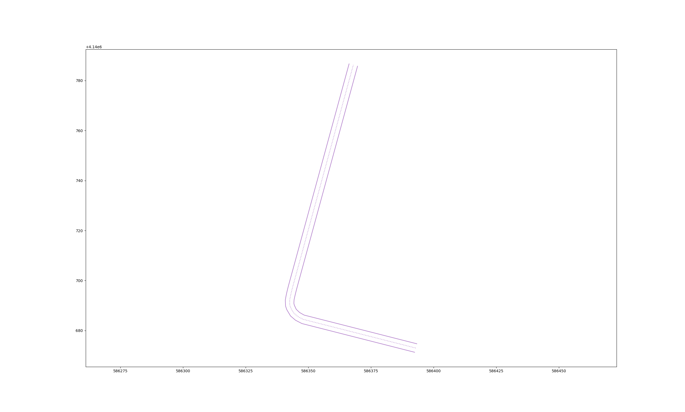
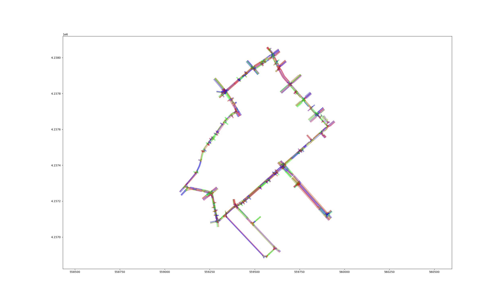
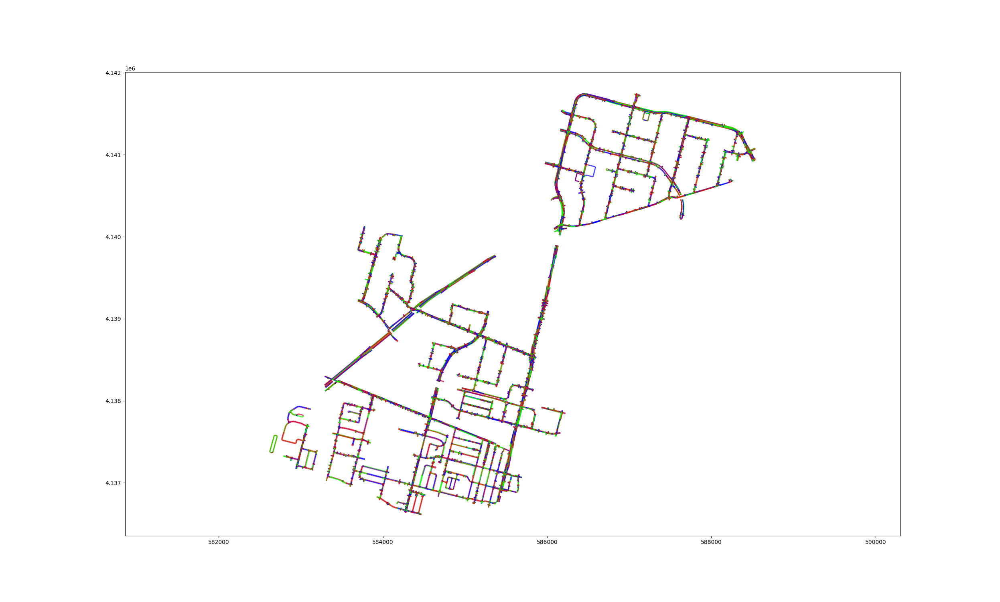
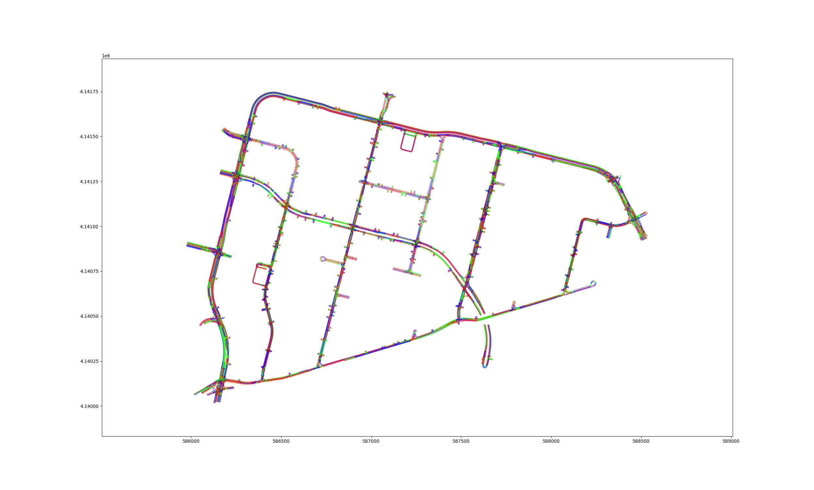

# Map Data

A bundle of correlated maps are organized as a directory, with a structure like:

```txt
<map_dir>                        # Defined by FLAGS_map_dir
  |-- base_map.xml               # Defined by FLAGS_base_map_filename
  |-- routing_map.bin            # Defined by FLAGS_routing_map_filename
  |-- sim_map.bin                # Defined by FLAGS_sim_map_filename
  |-- default_end_way_point.txt  # Defined by FLAGS_end_way_point_filename
```

You can specify the map filenames as a list of candidates:

```txt
--base_map_filename="base.xml|base.bin|base.txt"
```

Then it will find the first available file to load. Generally we follow the
extension pattern of:

```txt
x.xml  # An OpenDrive formatted map.
x.bin  # A binary pb map.
x.txt  # A text pb map.
```

## Difference between base\_map, routing\_map and sim\_map
* `base_map` is the most complete map that has all roads, lane geometry and labels. The other maps are generated based on `base_map`.

* `routing_map` has the topology of the lanes in `base_map`. It can be generated by command:
  ```
   dir_name=modules/map/data/demo # example map directory
   ./scripts/generate_routing_topo_graph.sh --map_dir ${dir_name}
  ```

* `sim_map` is a light weight version of `base_map` for dreamview visualization. It has reduced data density for better runtime performance. It can be generated by command:
  ```
  dir_name=modules/map/data/demo # example map directory
  bazel-bin/modules/map/tools/sim_map_generator --map_dir=${dir_name} --output_dir=${dir_name}
  ```

## Use a different map

1. [Preferred] Change global flagfile: *modules/common/data/global_flagfile.txt*

   Note that it's the basement of all modules' flagfile, which keeps the whole
   system in one page.

1. Pass as flag, which only affects an individual process:

   ```bash
   <binary> --map_dir=/path/to/your/map
   ```

1. Override in the module's own flagfile, which is generally located at
   *modules/<module_name>/conf/<module_name>.conf*

   Obviously it also only affects a single module.

   ```txt
   --flagfile=modules/common/data/global_flagfile.txt

   # Override values from the global flagfile.
   --map_dir=/path/to/your/map
   ```

## Visualize map
   ```
   source set_python_env.bash
   python3 ./modules/tools/mapshow/mapshow.py -m ./modules/map/data/sunnyvale_loop/base_map.bin
   ```
- apollo_virutal_map


- borregas_ave


- demo


- san_mateo


- sunnyvale


- sunnyvale_big_loop


- sunnyvale_loop


- sunnyvale_with_two_offices
